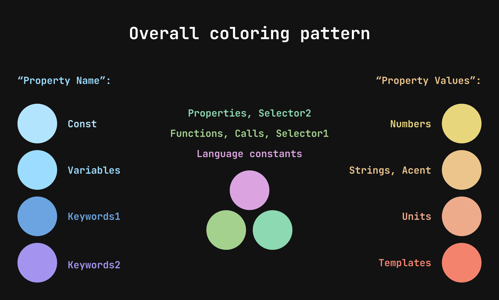

# Cosmical Theme

A Space-inspired Dark theme for those who want an alternative to all the bluish themes out there... This theme balances the use of contrast and color to make the different code elements more distinguishable, following a hierarchy of importance.  
It also comes with a carefully picked color palette that blends in very nicely.

🌌 It will make you feel like you are an astronaut coding in space! 🌌

<br>

## Installing

#### Get it now from the [VSCode marketplace](https://marketplace.visualstudio.com/items?itemName=jorgemrtr.cosmical)!

Click on "Install" and "Set Color theme"

<br>


<br>

## Colors

-   A beautiful and well-thought color palette to provide amazing contrast and color distinction, making a nicely balanced theme.
-   The different parts of the code can be distinguished by color and contrast following an hierarchy of importance.
-   To help the user, this theme follows its own coloring pattern across different file formats.



<br>

## Background

-   Neutral background following the material guidelines for dark themes.
-   Non-blueish background to improve sleep by decreasing blue-light exposure.
-   Provides a good amount of contrast following accessibility guidelines without being too high contrast.

<br>
<br>

# Recomended settings (Optional)

These are some of my favourites settings based on my personal setup, you can change VSCode settings by:

```
Opening command palette (ctrl + shift + P)
Typing "Open Settings (JSON)"
Copy the following settings to your JSON inside the brackets

```

## 1. Braket Pairing indent lines

This setting is built in VSCode, I only turn on the option that draws colored vertical and horizontal lines because I find that the actual bracket colorization makes reading the code confusing

```
"editor.bracketPairColorization.enabled": false,
"editor.guides.bracketPairs": true,
"editor.guides.bracketPairsHorizontal": true,
```

#### Comparison:

##### Brackets Pairs Off


##### Brackets Pairs On


<br>

## 2. Custom Font: "JetBrains Mono"

I feel like "JetBrains Mono" makes reading code a lot more nicer than the default 'Consolas' font. You can install it from [Google fonts](https://fonts.google.com/specimen/JetBrains+Mono#standard-styles)

```
"editor.fontFamily": "'JetBrains Mono', 'Consolas', 'monospace'",
```

It also comes with ligatures that can make you code more aesthetic but can be confusing, they come disabled by default in VSCode

```
"editor.fontLigatures": true,``
```

<br>

## 3. Icon Pack: "Material Icon Theme"

My recommendation for icon pack is "Material Icon Theme" by Philipp Kief.
Having an icon pack helps you differenciate the content inside your project.

I like to turn down saturation a bit so it isn't too distracting:

```
"material-icon-theme.saturation": 0.8,
```

<br>
<br>

# Contributing

I was inspired by: Dark+ default theme, Night Owl and the material guidelines

This is my first theme release and it's only tested for Javascript, React, HTML, CSS if you want to contribute please check the github repo: https://github.com/jorgemrtr/cosmical-theme
