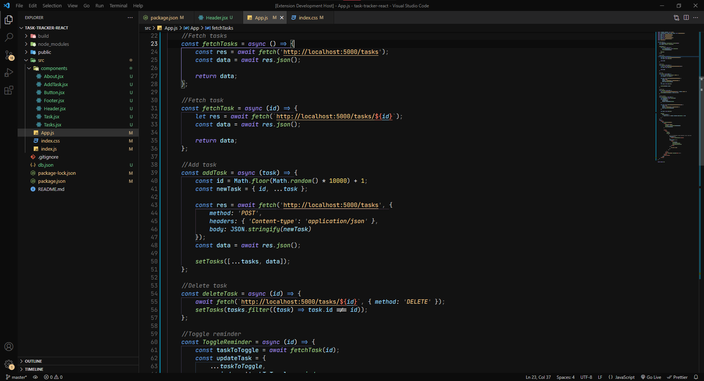
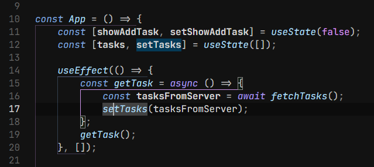

# Cosmical Theme

A Dark theme for those who want an alternative to all the bluish themes out there... Inspired by the dark+ default theme, it aims to improve contrast and provides a brand new color palette that blends in very nicely

It will make you feel like you are an astronaut coding in space!



## Colors

-   Beautiful handpicked colors that blend in nicely
-   Neutral background following the material guidelines for dark themes, so you are not distracted
-   The colors are chosen so the code stands out from the rest of the UI elements

## Background

-   Non-Bluish background to improve sleep by decreasing blue-light exposure
-   Provides good amount of contrast following accesibility guidelines without being too high contrast

# Recomended settings (Optional)

these are some of my favourites based on my personal setup, you can change the settings by:

```
Opening command palette (ctrl + shift + P)
Typing "Open Settings (JSON)"
Copy the following settings

```

## 1. Custom Font: "JetBrains Mono"

I feel like 'JetBrains Mono' makes reading code a lot more nicer than the default 'Consolas' font. You can install it from [Google fonts](https://fonts.google.com/specimen/JetBrains+Mono#standard-styles)

```
"editor.fontFamily": "'JetBrains Mono', 'Consolas', 'monospace'",
```

## 2. Braket Pairing

This setting is now built in VSCode, I actually only turn on the option that draws colored lines because I find that the actual bracket colorization makes reading the code confusing

```
"editor.bracketPairColorization.enabled": false,
"editor.guides.bracketPairs": true,
"editor.guides.bracketPairsHorizontal": true,
```

#### Comparison:

-   Brackets Pairs Off  
    
-   Brackets Pairs On
    

## 3. Icon Pack: "Material Icon Theme"

My recommendation for icon pack is "Material Icon Theme" by Philipp Kief.
Having an icon pack helps you differenciate the content inside your project.

I like to turn down saturation a bit so it isn't too distracting:

```
"material-icon-theme.saturation": 0.8,
```

# Contributing

This theme takes inspiration from: Night Owl, the material guidelines and the Dark+ default theme

This is my first theme release and the theme is only tested for Javascript, React, HTML, CSS and Java, if you want to contribute please check the github repo: https://github.com/jorgemrtr/cosmical-theme
